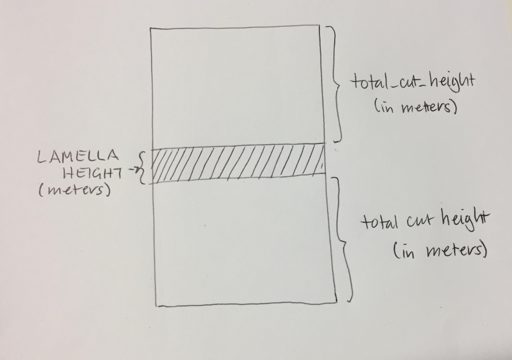
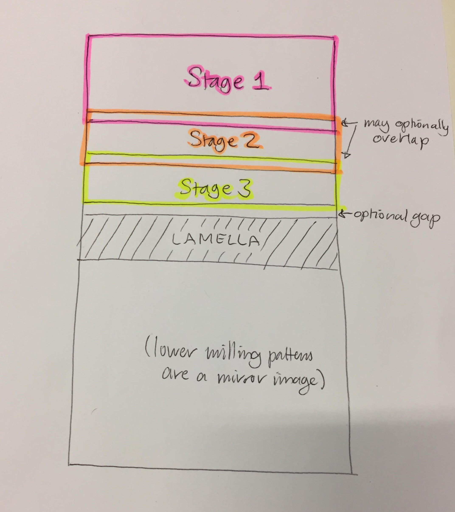
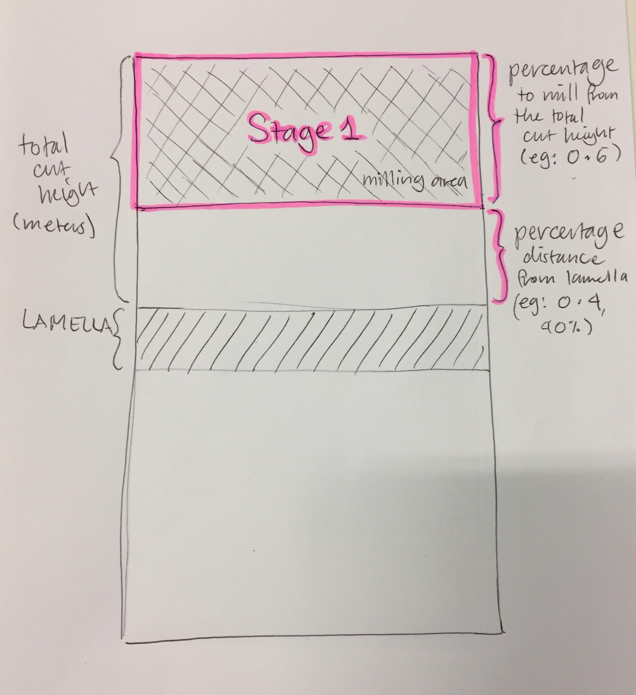
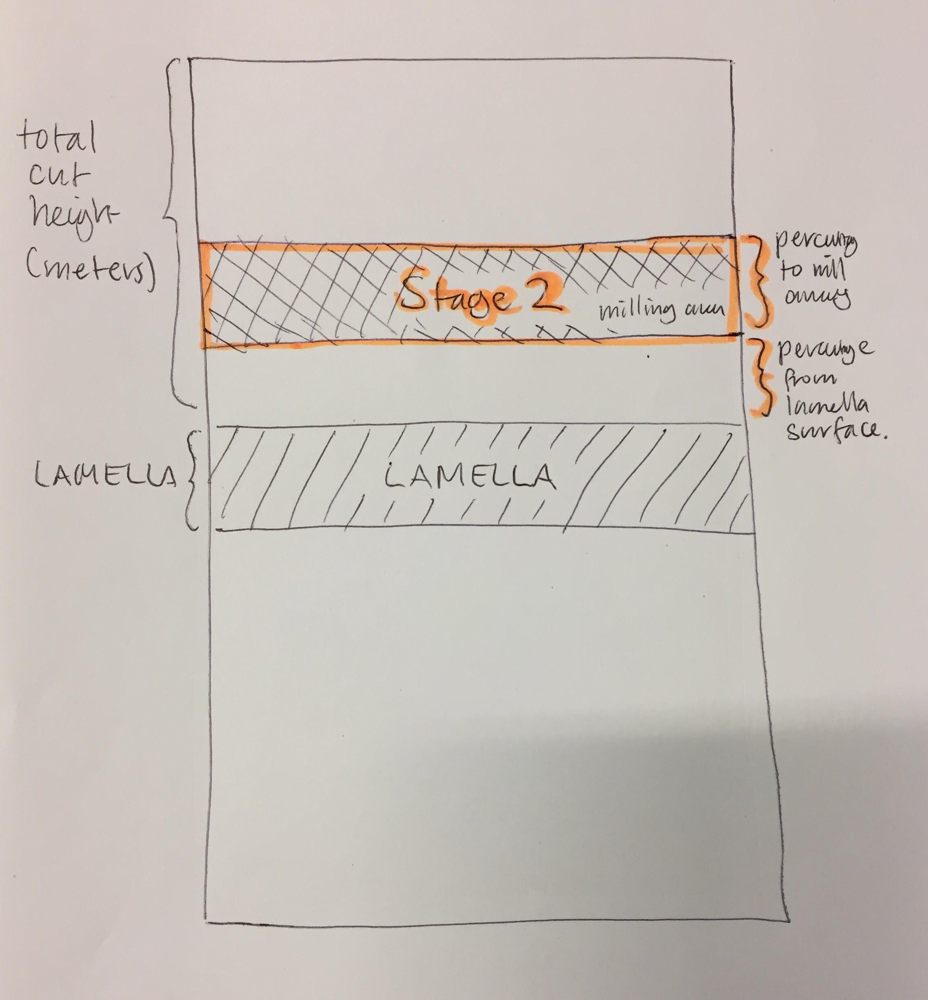
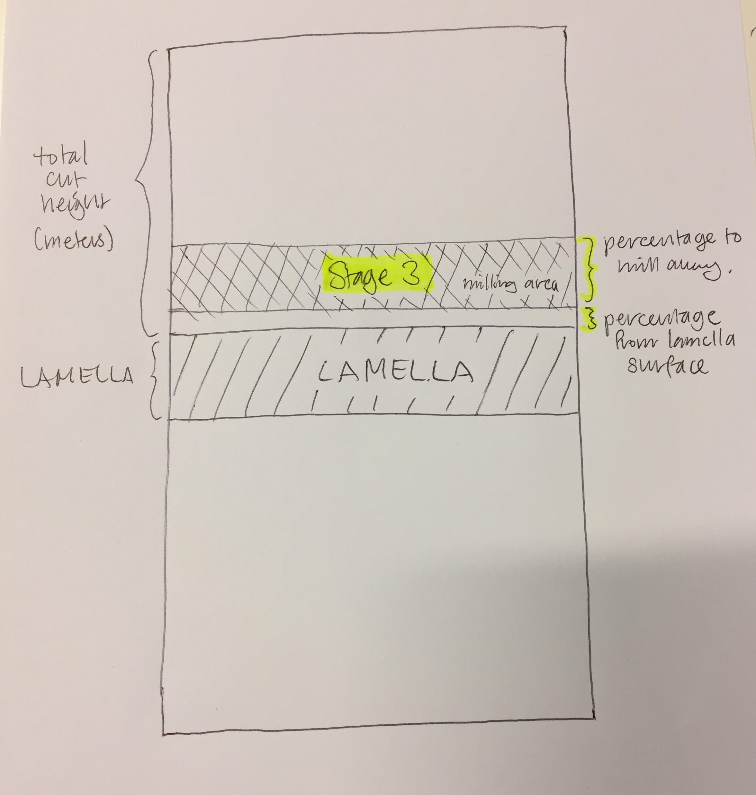

# User input

Users must provide input parameters for their experiment as a protocol YAML file, for example:

`protcol_example.yml`

```yaml
system:
  ip_address: '192.168.0.1' # IP address to connect to the microscope.
  application_file_rectangle: "Si" # Application file for rectangle milling.
  application_file_cleaning_cross_section: "Si" # Application file for cleaning cross section milling.
imaging:
  horizontal_field_width: 100e-6 # Horizontal field of view for imaging, in meters.
  dwell_time: 1e-6 # Dwell time for imaging, in seconds
  resolution: "1536x1024" # Must be one of the set resolutions available.
lamella:
  lamella_width: 10e-6 # in meters
  lamella_height: 3e-6 # in meters
  total_cut_height: 6e-6 # in meters
  milling_depth: 1e-6 # default milling depth, unless otherwise specified
  milling_current: 0.74e-9 # default milling current, unless otherwise specified
  protocol_stages: # stages will be milled in the order they appear here
    # rough_cut
    - percentage_roi_height: 0.3 # fractional percentage of total_cut height
      percentage_from_lamella_surface: 0.7 # fractional percentage
      milling_current: 0.74e-9 # in meters
    # regular_cut
    - percentage_roi_height: 0.8 # fractional percentage of total_cut height
      percentage_from_lamella_surface: 0.0 # fractional percentage
      milling_current: 0.74e-9 # in Amps
      milling_depth: 0.6e-6 # in meters
jcut:
  jcut_milling_current: 0.74e-9 # in Amps. Ion beam milling current for J-cut.
  jcut_angle: 6  # in degrees. Angle of sample surface relative to electron beam for the J-cut.
  jcut_length: 7e-6 # in meters. Longest (top) axis of the J-cut shape.
  jcut_lamella_depth: 5e-6 # in meters.
  jcut_trench_thickness: 1e-6 # in meters. Thickness of J-cut milling pattern lines.
  jcut_milling_depth: 3e-6 # in meters. Depth of ion beam milling patterns for the J-cut.
  extra_bit: 8e-6  # J-cut should extend out a little past the lamella, by this much.
  mill_lhs_jcut_pattern: true # Whether to mill the left hand side of the J-cut pattern (true or false)
  mill_rhs_jcut_pattern: true # Whether to mill the right hand side of the J-cut pattern (true or false)
  mill_top_jcut_pattern: true # Whether to mill the top bar of the J-cut pattern (true or false)
```

The size of the trenches above and below the lamella is controlled by `total_cut_height` in the user input parameters.

For liftout preparation, we recommend a two stage trench milling protocol. (The following diagrams show a three stage protocol instead of a simpler two stage trench protocol):



The positions for the milling patterns at each of these stages may overlap, or not. This diagram (not to scale) shows three stages with a small amount of overlap:



To give the greates amount of flexibility to the user, the position of milling patterns for each milling stage are defined by two parameters: `percentage_roi_height`, and `percentage_from_lamella_surface`.

These are both percentages represented as *fractions* (eg: 0.5 is 50%).
* `percentage_roi_height` describes how large the size of the milling pattern for this stage should be, as a proportion of the total combined milling area (`total_cut_height`).
* `percentage_from_lamella_surface` describes how far away from the lamella surface the closest edge of the milling pattern should sit, as a proportion of the total combined milling area (`total_cut_height`).

These diagrams (not to scale) show this for our example protocol.






